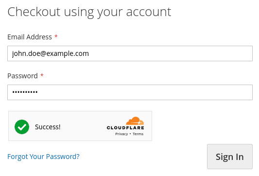

# Magento Cloudflare Turnstile

[](https://php.net/)
[](https://www.prestashop.com)
[](https://github.com/Pixel-Open/magento-cloudflare-turnstile/releases)

## Presentation

[Turnstile](https://developers.cloudflare.com/turnstile/) is Cloudflare's smart CAPTCHA alternative. The module allows Turnstile to protect your Magento or Adobe Commerce forms:

- Contact
- Login
- Register
- Reset password
- Review



## Requirements

- Magento >= 2.4.4
- PHP >= 7.4.0

## Installation

```
composer require pixelopen/magento-cloudflare-turnstile
```

## Configuration

### Disable all Magento Captcha

*Stores > Configuration > Customers > Customer Configuration > CAPTCHA*

- **Enable CAPTCHA on Storefront**: no

*Stores > Configuration > Security > Google reCAPTCHA Storefront > Storefront*

- **Enable for Customer Login**: no
- **Enable for Forgot Password**: no
- **Enable for Create New Customer Account**: no
- **Enable for Contact Us**: no
- **Enable for Product Review**: no

### Enable Cloudflare Turnstile

*Stores > Configuration > Customers > Cloudflare Turnstile > Settings*

- **Enable**: enable Cloudflare Turnstile
- **Sitekey**: the sitekey given for the site in your Cloudflare dashboard
- **Secret key**: the secret key given for the site in your Cloudflare dashboard
- **Theme**: the Turnstile theme (auto, light or dark)
- **Forms to validate**: the forms where a Turnstile validation is required

### Testing

Use the following sitekeys and secret keys for testing purposes:

**Sitekey**

| Sitekey                  | Description                     |
|--------------------------|---------------------------------|
| 1x00000000000000000000AA | Always passes                   |
| 2x00000000000000000000AB | Always blocks                   |
| 3x00000000000000000000FF | Forces an interactive challenge |

**Secret key**

| Secret key                          | Description                          |
|-------------------------------------|--------------------------------------|
| 1x0000000000000000000000000000000AA | Always passes                        |
| 2x0000000000000000000000000000000AA | Always fails                         |
| 3x0000000000000000000000000000000AA | Yields a "token already spent" error |
